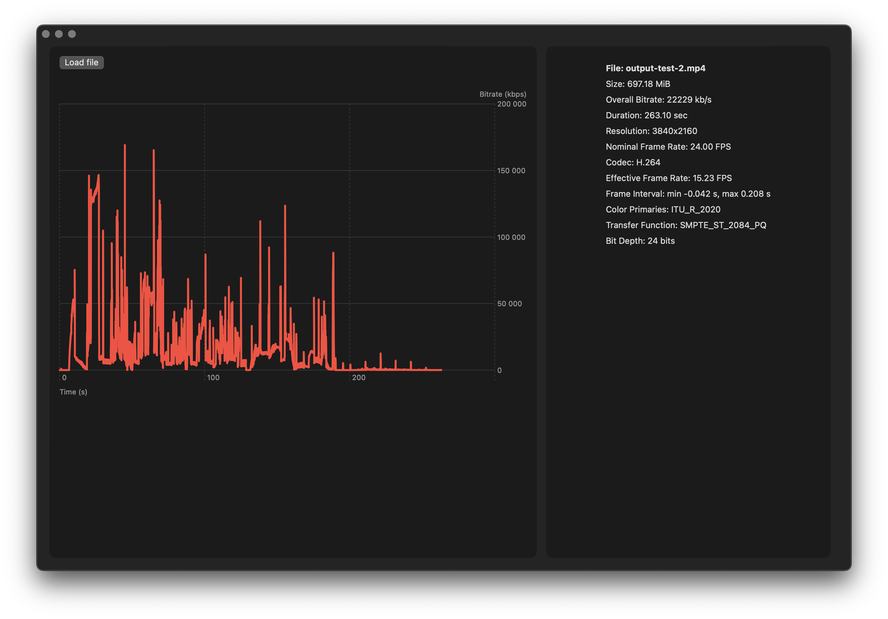

# MediaInspector

MediaInspector is a macOS application that utilizes AVFoundation to make it easy to quickly inspect video and audio files. It displays per-frame bitrate data in a chart as well as metadata, including resolution, duration, codec, color information.

